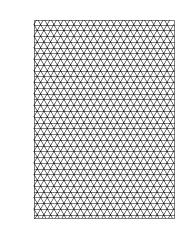

This notebook uses Tessellator library for generating A4 printable pages with grid by default.

It can be modified to fill and generate printable PDF or images of any shape filled with tessellations.

alg_no can be changed from 0-12 to select the specific tessellation algorithm.

Point(10,10) is the seed starting point. Tessellator can also take parameters of starting angle and different side unit lengths.

# 1) Preparation

First we need to format logging to nicely format log messages as we please!


```python
import logging
logger = logging.getLogger()
console_handler = logging.StreamHandler()
console_handler.setLevel(logging.DEBUG)
formatter = logging.Formatter("=[%(levelname)s @ %(filename)s (L=%(lineno)s) F=%(funcName)s() ]= %(message)s")
console_handler.setFormatter(formatter)
logger.addHandler(console_handler)   
```

Because our notebooks are in a subfolder, we need to add parent folder to sys.path!


```python
import sys, os
sys.path.insert(1, os.path.join(sys.path[0], '..'))
```

# 2) Import libraries and create helper functions


```python
    from shapely.geometry import Point, LinearRing, LineString, MultiLineString
    %matplotlib inline
    from matplotlib import pyplot
    
    from matplotlib.backends.backend_pdf import PdfPages

    import math
```


```python
def get_coords_from_points (points, closed):
    x = [0]  #Do we need these inital coordinates? What happens when one point is given??? Auto draw points of Ring/String as well??? TODO...
    y = [0]
    coord_list = []
    data = None
    if isinstance(points, Point) or isinstance(points, LinearRing) or isinstance(points, LineString) or isinstance(points, MultiLineString):
        return points.xy
    if len(points)>0:
        if isinstance(points, dict):
            pts = []
            for label in points:
                pts.append(points[label])
            points = pts
        if isinstance(points[0], list) and isinstance(points[0][0], Point):
            pts = []
            for ptl in points:
                #print()
                pts.append(LineString([(ptl[0].x, ptl[0].y), (ptl[1].x, ptl[1].y)]))
            points = pts
        
        if isinstance(points[0], LineString):
            data = MultiLineString(points)
            for ln in data:
                x, y = ln.xy
                coord_list.append((x, y))
            return coord_list
    if(len(points)>1):
        if closed:
            data = LinearRing(points)
        else:
            data = LineString(points)
        return data.xy
    return (x, y)


def plot(points, color = True, closed=False):
    pyplot.axis('off')
    fig = pyplot.figure(1, dpi=90)
    ax = fig.add_subplot(111)
    ax.set_aspect(1)
    res = get_coords_from_points(points, closed)
    if isinstance(res, list):
        for x, y in res:
            if color:
                ax.plot(x, y, marker = '.') #Plots with dots and colours
            else:
                ax.plot(x, y, marker = '', color='black', linewidth=0.5)   #Plots for printing (black and white)
    else:
        x, y = res
        if color:
            ax.plot(x, y, marker = '.')
        else:
            ax.plot(x, y, marker = '', color='black', linewidth=0.5)
    return fig

```

# 3) Work with tessellation grids


```python
from tessellator import Tessellator
```


```python
# Bounding box for A4 page
bound = [[0,0],[21,0],[21,29.7], [0,29.7]]
# Selection of specific algorithm
alg_no = 0

#Generate tessellation
tessellator = Tessellator(algorithm = Tessellator.ALGORITHMS[alg_no], bounds = bound, edge_length = 1, maximum_iterations = 10000)
tessellator.generate(Point(10,10),0)
tess_result = tessellator.get_generated_grid()

#Create visual plot for saving as PDF
plot(tess_result, color = False)
myfig = plot(bound, color = False)
```





```python
#Save plot as pdf on A4
myfig.set_size_inches(8.267,11.692)

with PdfPages('tesselation_'+Tessellator.ALGORITHMS[alg_no]+'.pdf') as pp:
    pp.savefig(myfig, bbox_inches='tight')
    


```
